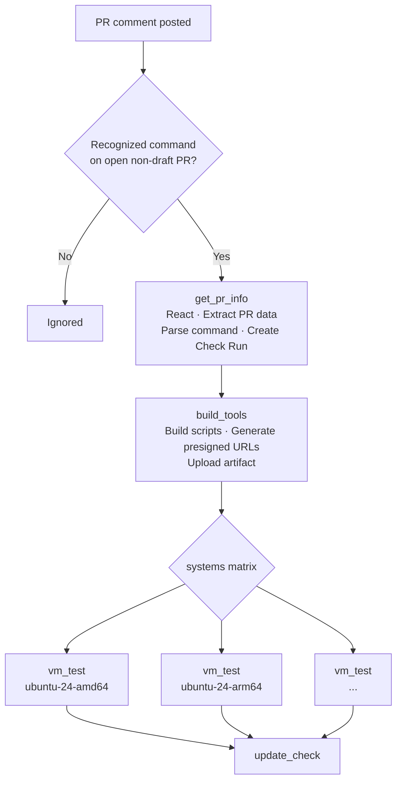
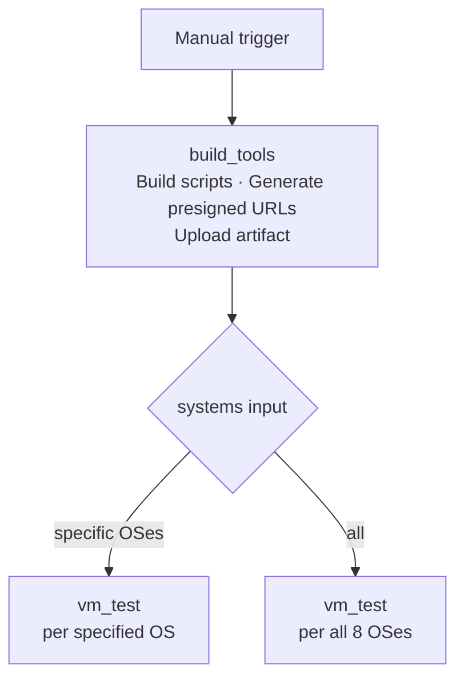

# Installation Assistant Integration Tests

Workflow file: `.github/workflows/check_integration_tools.yaml`

This workflow builds the installation assistant scripts from the PR branch, provisions one AWS VM per target OS, installs Wazuh using the built scripts (AIO, distributed, or offline mode), and runs the integration test suite against the live installation. Each OS in the test matrix runs independently.

---

## Triggers

| Mode | Trigger | Who can trigger |
|---|---|---|
| PR comment | `issue_comment` on an open, non-draft PR | Any repo collaborator |
| Manual | `workflow_dispatch` | Anyone with repo write access |

---

## Execution Flows

### issue_comment flow



**Recognized commands:**

| Comment | `tool_type` | `install_mode` | Check name |
|---|---|---|---|
| `/test-install` | `installer` | `aio` | Installation Assistant Check |
| `/test-install-distributed` | `installer` | `distributed` | Installation Assistant Check (Distributed) |
| `/test-install-offline` | `installer` | `offline` | Installation Assistant Check (Offline) |
| `/test-cert-tool` | `cert-tool` | `aio` | Certificates Tool Check |
| `/test-passwords-tool` | `passwords-tool` | `aio` | Passwords Tool Check |
| `/test-assistant` | `all` | `aio` | Full Integration Check |

When triggered by PR comment, the OS matrix always expands to all 8 supported systems and `package_type` is always `staging`.

### workflow_dispatch flow



---

## Parameters

### workflow_dispatch inputs

| Input | Required | Default | Description |
|---|---|---|---|
| `pr_head_ref` | Yes | — | Branch of `wazuh-installation-assistant` to test |
| `automation_reference` | No | `5.9.9` | Branch of `wazuh-automation` to use |
| `tool_type` | Yes | — | `installer`, `cert-tool`, `passwords-tool`, or `all` |
| `install_mode` | No | `aio` | `aio`, `distributed`, or `offline` — applies to `installer` and `all` only |
| `package_type` | No | `staging` | `staging` (dev packages) or `production` (official packages) |
| `systems` | No | `all` | Comma-separated OS identifiers (e.g. `ubuntu-24-amd64,redhat-9-arm64`) or `all` |

### issue_comment parameters

| Parameter | Source |
|---|---|
| `pr_head_ref` | PR head branch from GitHub API |
| `tool_type` | Parsed from comment command |
| `install_mode` | Parsed from comment command |
| `package_type` | Fixed: `staging` |
| `systems` | Fixed: all 8 supported OSes |
| `automation_reference` | Defaults to `main` |

---

## Supported Systems

The full OS matrix (`all`) expands to:

| OS identifier | Architecture |
|---|---|
| `ubuntu-24-amd64` | x86_64 |
| `ubuntu-24-arm64` | ARM64 |
| `ubuntu-22-amd64` | x86_64 |
| `ubuntu-22-arm64` | ARM64 |
| `redhat-9-amd64` | x86_64 |
| `redhat-9-arm64` | ARM64 |
| `redhat-10-amd64` | x86_64 |
| `redhat-10-arm64` | ARM64 |

---

## Job Details

### Job 1 — `get_pr_info` (issue_comment only)

| Step | What it does |
|---|---|
| React to comment | Adds a 🚀 reaction to the triggering PR comment |
| Extract PR data | Calls GitHub API to get PR `head_ref` and `head_sha` |
| Parse command | Maps comment text → `tool_type`, `install_mode`, and `check_name` |
| Create Check Run | Creates a GitHub Check Run in `in_progress` state on the PR head SHA |

### Job 2 — `build_tools` (both triggers)

Builds the installation scripts from the PR branch and uploads them as a workflow artifact.

| Step | What it does |
|---|---|
| Resolve context | Reads `tool_type`, `install_mode`, `package_type`, `pr_head_ref`, and `matrix` from inputs or `get_pr_info` outputs |
| Checkout branches | Checks out `wazuh-installation-assistant` at `pr_head_ref` and `wazuh-automation` at `automation_reference` |
| Get Wazuh version | Reads `version` from `wazuh-installation-assistant/VERSION.json` |
| Build tool(s) | Runs `builder.sh` — always builds the installer (`-i`); conditionally builds cert-tool (`-c`) and passwords-tool (`-p`) based on `tool_type` |
| Configure AWS | Assumes `AWS_IAM_ROLE` via OIDC |
| Generate presigned URLs | Runs `generate_presigned_dev_urls.py --process test_assistant` to produce `/tmp/artifact_urls.yaml` |
| Stage artifacts | Copies built scripts and `artifact_urls.yaml` to `/tmp/built-tools/` |
| Upload artifact | Uploads `built-tools` artifact (retained 1 day) |

Outputs: `tool_type`, `install_mode`, `package_type`, `pr_head_ref`, `wazuh_version`, `matrix`.

> The `staging` package type sets `DEV_FLAG=-d local` when running the installer, instructing it to use the presigned dev URLs instead of the official packages repository.

### Job 3 — `vm_test` (matrix: systems)

Runs once per OS in the matrix. Each instance provisions its own VM and runs independently (`fail-fast: false`).

#### Setup

1. Checkout `wazuh-automation` at `automation_reference`
2. Set up Python 3.12
3. Install dependencies: `deployability` requirements, `integration-test-module` requirements and package
4. Configure AWS credentials via OIDC (`AWS_IAM_ROLE`)

#### Instance allocation

Provisions a dedicated AWS VM using the `deployability` allocator:

```bash
python3 wazuh-automation/deployability/modules/allocation/main.py \
  --action create \
  --provider aws \
  --size xlarge \
  --composite-name {system} \
  --instance-name gha_{run_id}_{system}_tool_check \
  --label-team devops \
  --label-termination-date 1d
```

The allocator writes `inventory.yml` with SSH connection details (`ansible_host`, `ansible_port`, `ansible_user`, `ansible_ssh_private_key_file`). These are extracted and exported as `SSH_HOST`, `SSH_PORT`, `SSH_USER`, `SSH_KEY` environment variables.

#### Deploy tools to remote instance

1. Download the `built-tools` artifact
2. Set SSH/SCP helper variables
3. Copy scripts to `/tmp/` on the remote VM via SCP:
   - Always: `wazuh-install.sh`, `artifact_urls.yaml`
   - When `tool_type` is `cert-tool` or `all`: also `wazuh-certs-tool.sh`
   - When `tool_type` is `passwords-tool` or `all`: also `wazuh-passwords-tool.sh`
4. Generate and copy `config.yml` (when `install_mode` is `distributed` or `offline`, or `tool_type` is `cert-tool` or `all`):
   ```yaml
   nodes:
     indexer:   [{ name: indexer,   ip: 127.0.0.1 }]
     manager:   [{ name: manager,   ip: 127.0.0.1 }]
     dashboard: [{ name: dashboard, ip: 127.0.0.1 }]
   ```

#### Installation — AIO mode

Runs when `install_mode == aio` or `tool_type` is neither `installer` nor `all`:

```bash
sudo bash /tmp/wazuh-install.sh -a {DEV_FLAG} -id
```

A heartbeat loop logs progress every 60 seconds. On failure the last 50 lines of the install log are printed. Timeout: 60 minutes.

#### Installation — Distributed mode

Runs when `install_mode == distributed`. Executes five sequential SSH steps on the same VM (all single-node, simulating distributed layout):

| Step | Command | What it does |
|---|---|---|
| Generate certificates | `wazuh-install.sh -g -id` | Creates certificates and install files |
| Install indexer | `wazuh-install.sh -wi indexer {DEV_FLAG} -id` | Installs Wazuh Indexer |
| Initialize security | `wazuh-install.sh -s` | Initializes indexer cluster security settings |
| Install manager | `wazuh-install.sh -wm manager {DEV_FLAG} -id` | Installs Wazuh Manager |
| Install dashboard | `wazuh-install.sh -wd dashboard {DEV_FLAG} -id` | Installs Wazuh Dashboard |

Each step has a heartbeat loop and a 60-minute timeout.

#### Installation — Offline mode

Runs when `install_mode == offline`. All package preparation happens on the runner before copying to the remote:

1. **Detect package type and arch**: maps OS identifier to `deb`/`rpm` and `amd64`/`arm64`/`x86_64`/`aarch64`
2. **Install prerequisites on remote**: installs OS-specific packages (`debconf`, `adduser`, `procps`, etc. for deb; `coreutils`, `libcap`, `lsof`, etc. for rpm)
3. **Download offline packages on runner**: runs `wazuh-install.sh -dw {PKG_TYPE} -da {ARCH} {DEV_FLAG} -id` to produce `wazuh-offline.tar.gz`
4. **Generate install files on runner**: runs `wazuh-install.sh -g -id` to produce `wazuh-install-files.tar`
5. **Copy all files to remote**: SCP transfers `wazuh-install.sh`, `wazuh-offline.tar.gz`, `wazuh-install-files.tar`, `artifact_urls.yaml`, and `config.yml`
6. **Remove internet access**: switches the EC2 instance to the no-internet security group (`AWS_SG_OFFLINE`) via `aws ec2 modify-instance-attribute`
7. **Run offline installation**: `sudo bash /tmp/wazuh-install.sh -a -of` — Timeout: 60 minutes

#### Post-install steps

After any installation mode completes:

- **Disable host firewall**: `ufw disable` on Ubuntu; `systemctl stop firewalld` on RedHat
- **Wait for dashboard** (installer/all only): polls `https://localhost/status` up to 5 minutes until HTTP 200
- **Run cert-tool** (cert-tool/all only): copies `config.yml` and runs `sudo bash /tmp/wazuh-certs-tool.sh -A`
- **Run passwords-tool** (passwords-tool/all only): runs four `wazuh-passwords-tool.sh` invocations (admin, wazuh-server, wazuh-dashboard, and wazuh-wui), restarts services, then polls indexer port 9200, dashboard port 443, and manager API port 55000 until all accept the new credentials

#### Test execution

```bash
test_runner \
  --test-type "{tool_type}" \
  --ssh-host "{SSH_HOST}" \
  --ssh-port "{SSH_PORT}" \
  --ssh-key-path "{SSH_KEY}" \
  --ssh-username "{SSH_USER}" \
  --log-level INFO \
  --output github \
  --output-file "test-results-{system}.github"
```

| Argument | Value | Notes |
|---|---|---|
| `--test-type` | `installer`, `cert-tool`, `passwords-tool`, or `all` | Selects the test module set |
| `--ssh-host/port/key/username` | From allocator inventory | Connects to the allocated VM |
| `--output github` | — | Emits GitHub Actions annotations |

The step runs with `continue-on-error: true` so cleanup always proceeds regardless of test outcome.

For `installer` and `all` tool types, the workflow also runs an **uninstall phase** after the main tests:

1. **Uninstall**: runs `sudo bash /tmp/wazuh-install.sh --uninstall` on the remote VM (timeout: 30 minutes)
2. **Uninstall tests**: calls `test_runner --test-type uninstall` and writes `test-results-{system}-uninstall.github`

For details on what each test type validates, see the `Integration Test Module — Description` of the internal documentation.

#### Reporting

| Output | When | Content |
|---|---|---|
| Step summary | Always | Main and uninstall test results for this OS |
| PR comment | `issue_comment` trigger only | Posts or updates a comment (marker: `<!-- integration-check-{tool_type}-{install_mode}-{system} -->`) with ✅/❌ and results |
| Artifact: `test-results-{tool_type}-{install_mode}-{system}` | Always | Results files, retained 7 days |

#### Cleanup (always runs, even on failure)

Deallocates the VM:

```bash
python3 wazuh-automation/deployability/modules/allocation/main.py \
  --action delete \
  --track-output {ALLOCATOR_PATH}/track.yml
```

### Job 4 — `update_check` (issue_comment only)

Updates the GitHub Check Run created in Job 1:

| `vm_test` result | Check conclusion |
|---|---|
| `success` | `success` — ✅ All integration tests passed on all matrix OS |
| `failure` | `failure` — ❌ One or more tests failed |
| `cancelled` | `cancelled` |

---

## Required Secrets and Variables

### Secrets

| Secret | Used by |
|---|---|
| `AWS_IAM_ROLE` | OIDC role for AWS operations (allocator, ECR, EC2 SG changes) |
| `GH_CLONE_TOKEN` | Checkout `wazuh-automation` |
| `GITHUB_TOKEN` | PR comments and Check Run updates (built-in) |

### Repository variables

| Variable | Used by |
|---|---|
| `AWS_S3_BUCKET_DEV` | Dev package presigned URL generation |
| `AWS_SG_OFFLINE` | No-internet security group ID for offline installation tests |

---

## Permissions

| Permission | Purpose |
|---|---|
| `id-token: write` | OIDC authentication to AWS |
| `contents: read` | Checkout repository |
| `pull-requests: write` | Post PR comments |
| `issues: write` | Post comments via issues API |
| `checks: write` | Create and update GitHub Check Runs |

---

## Instance Naming

Allocated VMs are named:

```
gha_{github.run_id}_{system}_tool_check
```

Example: `gha_12345678_ubuntu-24-amd64_tool_check`

VMs are tagged with `termination-date: 1d` — they are automatically terminated after 24 hours as a safety net, even if the cleanup step fails.
