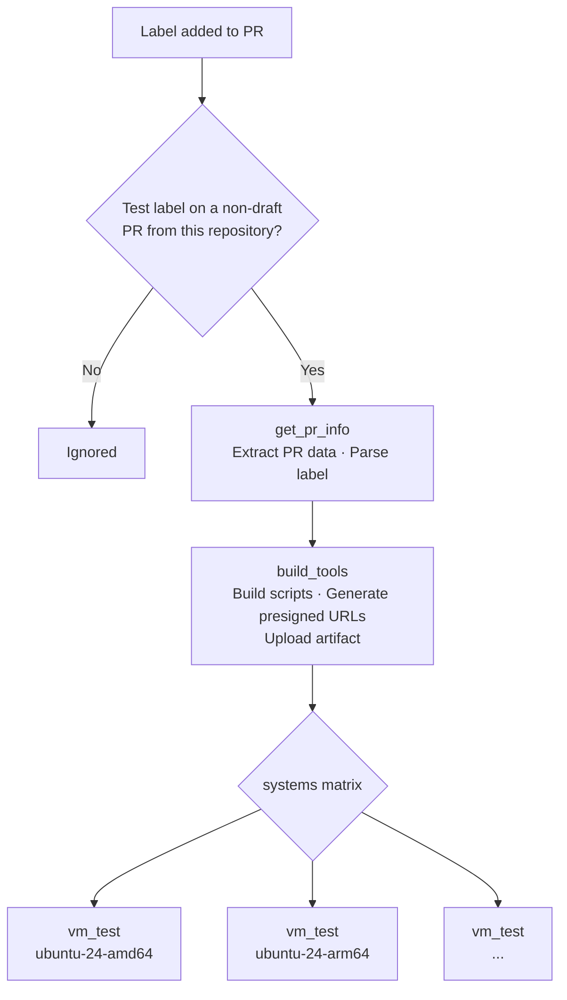
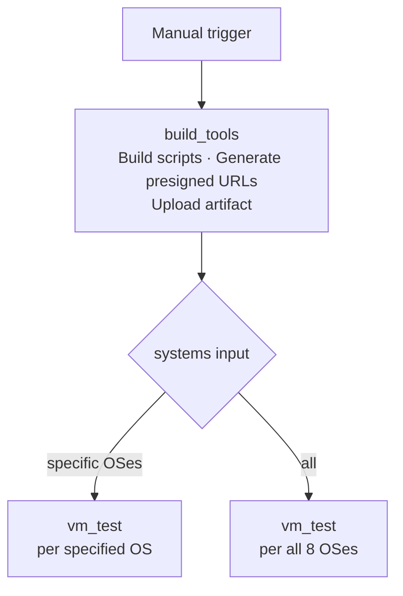

# Installation Assistant Integration Tests

Workflow file: `.github/workflows/5_check_integration_tools.yaml`

This workflow builds the installation assistant scripts from the PR branch, provisions one AWS VM per target OS, installs Wazuh using the built scripts (AIO, distributed, or offline mode), and runs the integration test suite against the live installation. Each OS in the test matrix runs independently.

---

## Triggers

| Mode | Trigger | Who can trigger |
|---|---|---|
| PR label | `pull_request` (`labeled`) on a non-draft PR opened from a branch of this repository | Anyone who can add labels (triage access or higher) |
| Manual | `workflow_dispatch` | Anyone with repo write access |

To run the tests on a pull request, add one of the labels listed in [pull_request (label) flow](#pull_request-label-flow). Each label added starts one run against the PR head at that moment:

- To run the tests again (for example after pushing new commits), remove the label and add it again.
- Labels added while the PR is a draft are ignored. Mark the PR as ready for review and add the label again.
- PRs opened from forks do not run: GitHub does not pass secrets or the OIDC token to `pull_request` runs from forks. Push the branch to this repository to test it.

---

## Execution Flows

### pull_request (label) flow


```mermaid
flowchart TD
    A[Label added to PR] --> B{Test label on a non-draft\nPR from this repository?}
    B -- No --> Z[Ignored]
    B -- Yes --> C[get_pr_info\nExtract PR data · Parse label]
    C --> D[build_tools\nBuild scripts · Generate presigned URLs\nUpload artifact]
    D --> E{systems matrix}
    E --> F[vm_test\nubuntu-24-amd64]
    E --> G[vm_test\nubuntu-24-arm64]
    E --> H[vm_test\n...]
```

**Labels:**

| Label | `tool_type` | `install_mode` | Check name |
|---|---|---|---|
| `test/install` | `installer` | `aio` | Installation Assistant Check |
| `test/install-distributed` | `installer` | `distributed` | Installation Assistant Check (Distributed) |
| `test/install-offline` | `installer` | `offline` | Installation Assistant Check (Offline) |
| `test/cert-tool` | `cert-tool` | `aio` | Certificates Tool Check |
| `test/passwords-tool` | `passwords-tool` | `aio` | Passwords Tool Check |
| `test/assistant` | `all` | `aio` | Full Integration Check |

When triggered by a PR label, the OS matrix always expands to all 8 supported systems and `package_type` is always `staging`.

### workflow_dispatch flow


```mermaid
flowchart TD
    A[Manual trigger] --> D[build_tools\nBuild scripts · Generate presigned URLs\nUpload artifact]
    D --> E{systems input}
    E -- specific OSes --> F[vm_test\nper specified OS]
    E -- all --> G[vm_test\nper all 8 OSes]
```

---

## Parameters

### workflow_dispatch inputs

| Input | Required | Default | Description |
|---|---|---|---|
| `pr_head_ref` | Yes | — | Branch of `wazuh-installation-assistant` to test |
| `automation_reference` | No | `5.0.0` | Branch of `wazuh-automation` to use |
| `tool_type` | Yes | — | `installer`, `cert-tool`, `passwords-tool`, or `all` |
| `install_mode` | No | `aio` | `aio`, `distributed`, or `offline` — applies to `installer` and `all` only |
| `package_type` | No | `staging` | `staging` (dev packages) or `production` (official packages) |
| `systems` | No | `all` | Comma-separated OS identifiers (e.g. `ubuntu-24-amd64,redhat-9-arm64`) or `all` |

### pull_request (label) parameters

| Parameter | Source |
|---|---|
| `pr_head_ref` | PR head branch from the event payload |
| `tool_type` | Mapped from the label name |
| `install_mode` | Mapped from the label name |
| `package_type` | Fixed: `staging` |
| `systems` | Fixed: all 8 supported OSes |
| `automation_reference` | The base branch of the PR (`github.base_ref`), for example `5.0.0` |

A label run uses the workflow file of the PR, with its changes. The manual dispatch uses the workflow file of `--ref` and the `automation_reference` input.

---

## Supported Systems

The full OS matrix (`all`) expands to:

| OS identifier | Architecture |
|---|---|
| `ubuntu-24-amd64` | x86_64 |
| `ubuntu-24-arm64` | ARM64 |
| `ubuntu-22-amd64` | x86_64 |
| `ubuntu-22-arm64` | ARM64 |
| `redhat-9-amd64` | x86_64 |
| `redhat-9-arm64` | ARM64 |
| `redhat-10-amd64` | x86_64 |
| `redhat-10-arm64` | ARM64 |

---

## Job Details

### Job 1 — `get_pr_info` (pull_request only)

| Step | What it does |
|---|---|
| Extract PR data | Reads the PR number, head branch and head SHA from the event payload |
| Parse label | Maps the label name → `tool_type`, `install_mode` |

### Job 2 — `build_tools` (both triggers)

Builds the installation scripts from the PR branch and uploads them as a workflow artifact.

| Step | What it does |
|---|---|
| Resolve context | Reads `tool_type`, `install_mode`, `package_type`, `pr_head_ref`, and `matrix` from inputs or `get_pr_info` outputs |
| Checkout branches | Checks out `wazuh-installation-assistant` at `pr_head_ref` and `wazuh-automation` at `automation_reference` |
| Get Wazuh version | Reads `version` from `wazuh-installation-assistant/VERSION.json` |
| Build tool(s) | Runs `builder.sh` — always builds the installer (`-i`); conditionally builds cert-tool (`-c`) and passwords-tool (`-p`) based on `tool_type` |
| Configure AWS | Assumes `AWS_IAM_ROLE` via OIDC |
| Generate presigned URLs | Runs `generate_presigned_dev_urls.py --process test_assistant` to produce `/tmp/artifact_urls.yaml` |
| Stage artifacts | Copies built scripts and `artifact_urls.yaml` to `/tmp/built-tools/` |
| Upload artifact | Uploads `built-tools` artifact (retained 1 day) |

Outputs: `tool_type`, `install_mode`, `package_type`, `pr_head_ref`, `wazuh_version`, `matrix`.

> The `staging` package type sets `DEV_FLAG=-d local` when running the installer, instructing it to use the presigned dev URLs instead of the official packages repository.

### Job 3 — `vm_test` (matrix: systems)

Runs once per OS in the matrix. Each instance provisions its own VM and runs independently (`fail-fast: false`).

#### Setup

1. Checkout `wazuh-automation` at `automation_reference`
2. Set up Python 3.12
3. Install dependencies: `deployability` requirements, `integration-test-module` requirements and package
4. Configure AWS credentials via OIDC (`AWS_IAM_ROLE`)

#### Instance allocation

Provisions a dedicated AWS VM using the `deployability` allocator:

```bash
python3 wazuh-automation/deployability/modules/allocation/main.py \
  --action create \
  --provider aws \
  --size xlarge \
  --composite-name {system} \
  --instance-name gha_{run_id}_{system}_tool_check \
  --label-team devops \
  --label-termination-date 1d
```

The allocator writes `inventory.yml` with SSH connection details (`ansible_host`, `ansible_port`, `ansible_user`, `ansible_ssh_private_key_file`). These are extracted and exported as `SSH_HOST`, `SSH_PORT`, `SSH_USER`, `SSH_KEY` environment variables, and `ansible_host_private_ip` as `PRIVATE_IP` (the step fails if the inventory has no private address).

#### Deploy tools to remote instance

1. Download the `built-tools` artifact
2. Set SSH/SCP helper variables
3. Copy scripts to `/tmp/` on the remote VM via SCP:
   - Always: `wazuh-install.sh`, `artifact_urls.yaml`
   - When `tool_type` is `cert-tool` or `all`: also `wazuh-certs-tool.sh`
   - When `tool_type` is `passwords-tool` or `all`: also `wazuh-passwords-tool.sh`
4. Generate and copy `config.yml` (when `install_mode` is `distributed`, or `tool_type` is `cert-tool` or `all`):
   ```yaml
   nodes:
     indexer:   [{ name: indexer,   ip: 127.0.0.1 }]
     manager:   [{ name: manager,   ip: 127.0.0.1 }]
     dashboard: [{ name: dashboard, ip: 127.0.0.1 }]
   ```

#### Installation — AIO mode

Runs when `install_mode == aio` or `tool_type` is neither `installer` nor `all`:

```bash
sudo bash /tmp/wazuh-install.sh -a {DEV_FLAG} -id
```

A heartbeat loop logs progress every 60 seconds. On failure the last 50 lines of the install log are printed. Timeout: 60 minutes.

#### Installation — Distributed mode

Runs when `install_mode == distributed`. Executes five sequential SSH steps on the same VM (all single-node, simulating distributed layout):

| Step | Command | What it does |
|---|---|---|
| Generate certificates | `wazuh-install.sh -g -as {PRIVATE_IP} -id` | Creates certificates and install files. `-g` refuses an agent listener certificate that names only loopback addresses, so `-as` adds the private address; the nodes stay on `127.0.0.1` and the services listen on localhost. The step then checks that `wazuh-install-files.tar` contains `credentials.env`, does not contain `root-ca.key`, and that `manager-remoted.pem` names `{PRIVATE_IP}` |
| Install indexer | `wazuh-install.sh -wi indexer {DEV_FLAG} -id` | Installs Wazuh Indexer |
| Initialize security | `wazuh-install.sh -s` | Initializes indexer cluster security settings |
| Install manager | `wazuh-install.sh -wm manager {DEV_FLAG} -id` | Installs Wazuh Manager |
| Install dashboard | `wazuh-install.sh -wd dashboard {DEV_FLAG} -id` | Installs Wazuh Dashboard |

Each step has a heartbeat loop and a 60-minute timeout.

#### Installation — Offline mode

Runs when `install_mode == offline`. All package preparation happens on the runner before copying to the remote:

1. **Detect package type and arch**: maps OS identifier to `deb`/`rpm` and `amd64`/`arm64`/`x86_64`/`aarch64`
2. **Install prerequisites on remote**: installs OS-specific packages (`debconf`, `adduser`, `procps`, etc. for deb; `coreutils`, `libcap`, `lsof`, etc. for rpm)
3. **Download offline packages on runner**: runs `wazuh-install.sh -dw {PKG_TYPE} -da {ARCH} {DEV_FLAG} -id` to produce `wazuh-offline.tar.gz`
4. **Copy all files to remote**: SCP transfers `wazuh-install.sh`, `wazuh-offline.tar.gz`, and `artifact_urls.yaml`. The offline all-in-one install does not use `wazuh-install-files.tar` nor `config.yml`: the packages create the root CA, the certificates, and the passwords
5. **Remove internet access**: switches the EC2 instance to the no-internet security group (`AWS_SG_OFFLINE`) via `aws ec2 modify-instance-attribute`
6. **Run offline installation**: `sudo bash /tmp/wazuh-install.sh -a -of` — Timeout: 60 minutes

#### Post-install steps

After any installation mode completes:

- **Disable host firewall**: `ufw disable` on Ubuntu; `systemctl stop firewalld` on RedHat
- **Wait for dashboard** (installer/all only): polls `https://localhost/status` with the `admin` password read from `/etc/wazuh/credentials.env` up to 5 minutes until HTTP 200
- **Run cert-tool** (cert-tool/all only): copies `config.yml`, removes any previous `/tmp/wazuh-certificates` and runs `sudo bash /tmp/wazuh-certs-tool.sh -A`, which uses the root CA in `/etc/wazuh/ca`
- **Run passwords-tool** (passwords-tool/all only): saves the `admin` password set by the installation as `WAZUH_OLD_PASSWORD` (masked), runs `wazuh-passwords-tool.sh -u kibanaserver` without `-p` and checks that the generated password is saved in `credentials.env`, is accepted by the indexer and replaces the previous one (both masked), then runs `wazuh-passwords-tool.sh -u <user> -p` with the new password on the standard input for `admin`, `kibanaserver`, `wazuh-manager`, `wazuh` and `wazuh-internal-client`, restarts services, then polls indexer port 9200, dashboard port 443, and manager API port 55000 until all accept the new credentials

#### Test execution

```bash
test_runner \
  --test-type "{tool_type}" \
  --ssh-host "{SSH_HOST}" \
  --ssh-port "{SSH_PORT}" \
  --ssh-key-path "{SSH_KEY}" \
  --ssh-username "{SSH_USER}" \
  --log-level INFO \
  --output github \
  --output-file "test-results-{system}.github"
```

| Argument | Value | Notes |
|---|---|---|
| `--test-type` | `installer`, `cert-tool`, `passwords-tool`, or `all` | Selects the test module set |
| `--ssh-host/port/key/username` | From allocator inventory | Connects to the allocated VM |
| `--output github` | — | Emits GitHub Actions annotations |

The step also passes `WAZUH_INSTALL_MODE` (the common name of the node certificates is the node name of `config.yml` with `-g`, and `hostname -s` with `-a`) and the expected versions `WAZUH_{MANAGER,INDEXER,DASHBOARD}_EXPECTED_VERSION`, taken from `VERSION.json` of the branch under test (with `-latest` for staging packages). For `installer` and `cert-tool`, `test_runner` reads the passwords from `/etc/wazuh/credentials.env` on the VM and masks them in the log.

The step runs with `continue-on-error: true` so the results are reported and cleanup always proceeds regardless of test outcome; the last step of the job fails it when the main or the uninstall tests failed.

For `installer` and `all` tool types, the workflow also runs an **uninstall phase** after the main tests:

1. **Uninstall**: runs `sudo bash /tmp/wazuh-install.sh --uninstall` on the remote VM (timeout: 30 minutes)
2. **Uninstall tests**: calls `test_runner --test-type uninstall` and writes `test-results-{system}-uninstall.github`

For details on what each test type validates, see the `Integration Test Module — Description` of the internal documentation.

#### Reporting

| Output | When | Content |
|---|---|---|
| Step summary | Always | Main and uninstall test results for this OS |
| PR comment | `pull_request` trigger only | Posts or updates a comment (marker: `<!-- integration-check-{tool_type}-{install_mode}-{system} -->`) with ✅/❌ and results |
| Artifact: `test-results-{tool_type}-{install_mode}-{system}` | Always | Results files, retained 7 days |

#### Cleanup (always runs, even on failure)

Deallocates the VM:

```bash
python3 wazuh-automation/deployability/modules/allocation/main.py \
  --action delete \
  --track-output {ALLOCATOR_PATH}/track.yml
```

After the cleanup, the job fails when `test_runner` reported a failed test (`run_tests` or `run_tests_uninstall` outcome `failure`), so that the check of the PR fails.

---

## Required Secrets and Variables

### Secrets

| Secret | Used by |
|---|---|
| `AWS_IAM_ROLE` | OIDC role for AWS operations (allocator, ECR, EC2 SG changes) |
| `GH_CLONE_TOKEN` | Checkout `wazuh-automation` |
| `GITHUB_TOKEN` | PR comments (built-in) |

### Repository variables

| Variable | Used by |
|---|---|
| `AWS_S3_BUCKET_DEV` | Dev package presigned URL generation |
| `AWS_SG_OFFLINE` | No-internet security group ID for offline installation tests |

---

## Permissions

| Permission | Purpose |
|---|---|
| `id-token: write` | OIDC authentication to AWS |
| `contents: read` | Checkout repository |
| `pull-requests: write` | Post PR comments |
| `issues: write` | Post comments via issues API |

---

## Instance Naming

Allocated VMs are named:

```
gha_{github.run_id}_{system}_tool_check
```

Example: `gha_12345678_ubuntu-24-amd64_tool_check`

VMs are tagged with `termination-date: 1d` — they are automatically terminated after 24 hours as a safety net, even if the cleanup step fails.
